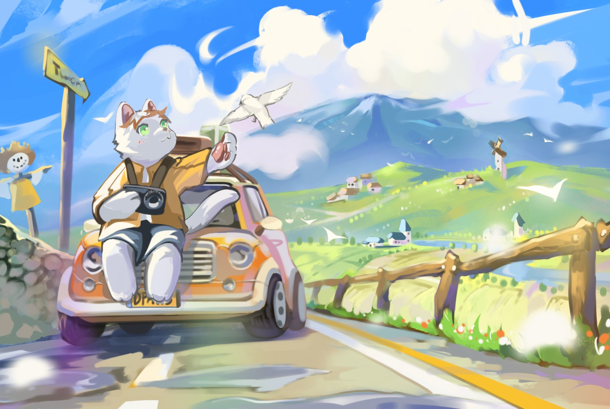

**Things About Me**
- Currently a student of the Ohio State University (2028)
- Python，Java, HTML+css+javascript
- E-mail: neyoki@proton.me / neyoki0the0cat@foxmail.com
- About me: Student developer💻, free to contact🤙
- Languages: English, 中文

<picture>
  <source media="(prefers-color-scheme: dark)" srcset="https://raw.githubusercontent.com/NeyokiCat/NeyokiCat/output/github-contribution-grid-snake-dark.svg">
  <source media="(prefers-color-scheme: light)" srcset="https://raw.githubusercontent.com/NeyokiCat/NeyokiCat/output/github-contribution-grid-snake.svg">
  
</picture>

**Skills**

